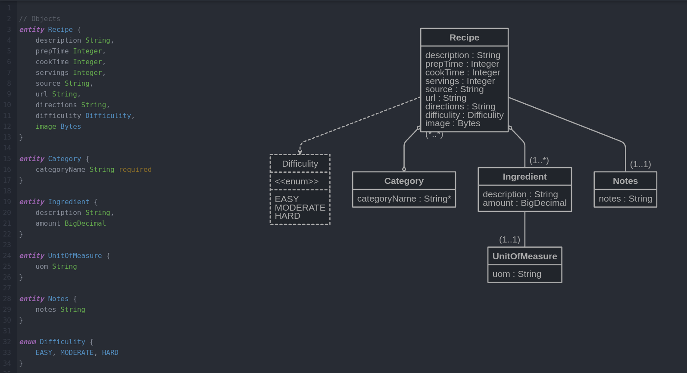

## Prerequisites
1. Go to https://start.spring.io/
2. Create your spring project and download
3. Create your repository and copy all the files from Spring project
4. Now you can run your SpringBootApplication

## Project
This is a simple Spring web application by means of MVC structure. The logic is as below:

## Dependencies
+ **spring-boot-starter** is the main dependency to start the app.
+ **spring-boot-starter-web** is to manage web related operations such as requests, mappings etc
+ **thymeleaf** template is valid HTML document that makes creating HTML pages easier. With thymeleaf, we can see a page in any browser or/and in compiler without running our application.
+ **spring-boot-starter-data-jpa** to manage data models, store and retrieve data in a relational database

## Data model:

## 
